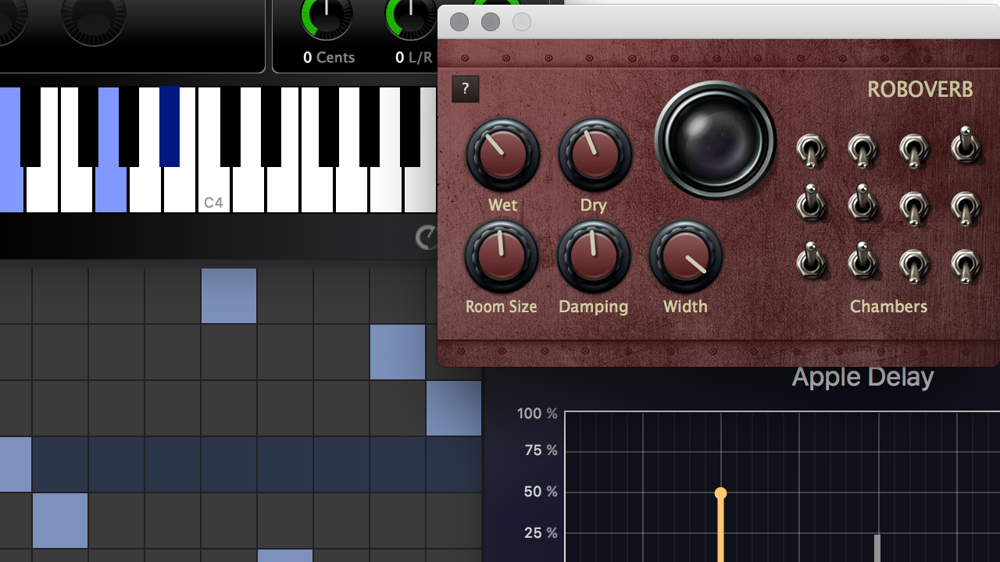

# Roboverb
Robotic reverb at your fingertips...


This is the 2.0 branch, and is a work in progrss. See the [v1](tree/v1) for the 
1.0.  Or the [currently released 1.0 version](https://kushview.net/roboverb) is 
available for download.

The **primary goal of 2.0** is to rewrite/redesign the UI using
[LVTK Widgets](https://gitlab.com/lvtk/lvtk), add LV2, add CLAP support, 
discontinue usage of Projucer.  2.0 will not introduce DSP changes causing 
audible difference.

#### Status of Formats
- [x] LV2 Plugin
- [ ] LV2 UI
- [ ] CLAP Plugin and GUI
- [ ] AU/VST/VST3 Plugin and Gui
- [ ] AAX Plugin and UI 

#### Building
Roboverb can be built with Meson.

```bash
meson setup build
meson compile -C build
```
